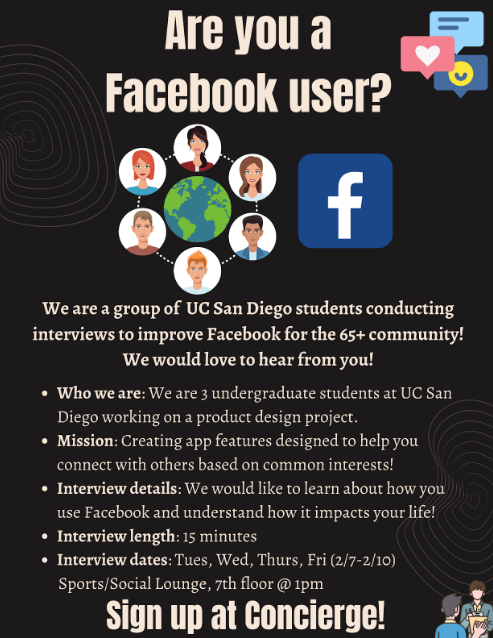

Improving Facebook to better facilitate community engagement with the 65+ community.

# Overview
During Winter 2023, myself (Kenny Nguyen) along with Yash Potdar and Qiaoxuan (Josh) Wang took on the task of improving upon existing and features in Facebook as well as implementing new ones in order to allow the 65+ community to more easily find events in the local community and leverage the application to create meaningful relationships with one another.  

# Objective
Due to Facebook's very complex and cluttered user interface (UI), we are aiming to create a more streamlined way for senior citizens (65+ years) to find communities in their local sphere in order to foster new relationships and engage with others in social settings. 

# Background Information
We plan to redesign Facebook to satisfy the essential life purpose of communication and community-building among senior citizens, who are often an overlooked target audience and face mental health issues at alarmingly high rates. Mental health among senior citizens is a big issue, as around 20% of individuals aged 55 or older have mental health problems as estimated by the CDC [1]. In fact, senior males have the highest rate of suicide among any other age group, and this may be due to depression or anxiety relating to aging and lack of motivation and fulfillment. Senior citizens are also more likely than other age groups to report that they “rarely” or “never” received the social and emotional support they needed [1]. This demonstrates that seniors are often an overlooked demographic in an increasingly digitized society and may be feeling left behind or isolated.

Our case study will be addressing the 65+ community on Facebook, which is a widely used application in our target audience. The plethora of features that Facebook offers may be overwhelming to a lot of the senior citizens and may dissuade them from trying to utilize this resource to find friends and relationships in the community.

We plan to design a way for elderly people to connect with others based on shared interests, digitizing concepts they may already be familiar with, such as penpals and book clubs. Our goal is to reduce sentiments of alienation and ensure that senior citizens are able to form meaningful relationships with others who share common interests, as well as find events that align with their hobbies. We plan to add an accessibility redesign to Facebook that will not impede current members’ experiences and could serve as an opt-in interface that is simpler and catered towards the 65+ community.

We have definitely witnessed in the case of our grandparents that they would be lonely and bored throughout the days since they cannot be as mobile as they used to. In Yash’s case, his grandparents were in India while he and his family were in the United States, so the physical isolation was a challenge for their mental health. Seniors may not have the energy to meet new people around them and they may be seeing their friends get sick. Mental health with seniors is an overlooked topic and we believe this would be an impactful project.

[1] https://www.cdc.gov/aging/pdf/mental_health.pdf

# User Research Methods
To gather information about our target demographic, our group interviewed residents as Belmont Village, a local retirement community in La Jolla, to gain insight on the current problems with the Facebook UI. We used two main methods of interviewing: direction observation and general questions.  Direct observation allows us to identify breakdowns in the current flow of Facebook, which are opportunities for us to develop a feature that is truly impactful. The general questions allow us to gain a focused idea of specific users, their past experiences, and general problems they have while using the app.

# Milestone 4

# Milestone 5

# Milestone 6

# Milestone 7

