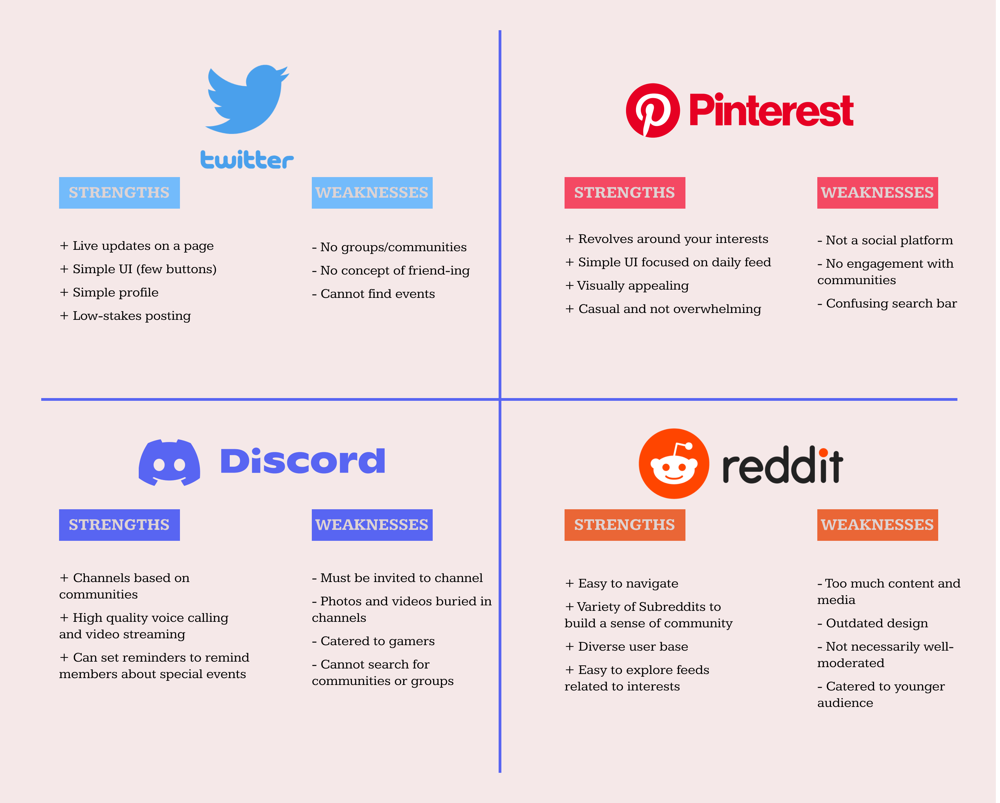

Improving Facebook to better facilitate community engagement with the 65+ community.

# Overview
During Winter 2023, myself (Kenny Nguyen) along with Yash Potdar and Qiaoxuan (Josh) Wang took on the task of improving upon existing and features in Facebook as well as implementing new ones in order to allow the 65+ community to more easily find events in the local community and leverage the application to create meaningful relationships with one another.  

# Objective
Due to Facebook's very complex and cluttered user interface (UI), we are aiming to create a more streamlined way for senior citizens (65+ years) to find communities in their local sphere in order to foster new relationships and engage with others in social settings. 

# Background Information
We plan to redesign Facebook to satisfy the essential life purpose of communication and community-building among senior citizens, who are often an overlooked target audience and face mental health issues at alarmingly high rates. Mental health among senior citizens is a big issue, as around 20% of individuals aged 55 or older have mental health problems as estimated by the CDC [1]. In fact, senior males have the highest rate of suicide among any other age group, and this may be due to depression or anxiety relating to aging and lack of motivation and fulfillment. Senior citizens are also more likely than other age groups to report that they “rarely” or “never” received the social and emotional support they needed [1]. This demonstrates that seniors are often an overlooked demographic in an increasingly digitized society and may be feeling left behind or isolated.

Our case study will be addressing the 65+ community on Facebook, which is a widely used application in our target audience. The plethora of features that Facebook offers may be overwhelming to a lot of the senior citizens and may dissuade them from trying to utilize this resource to find friends and relationships in the community.

We plan to design a way for elderly people to connect with others based on shared interests, digitizing concepts they may already be familiar with, such as penpals and book clubs. Our goal is to reduce sentiments of alienation and ensure that senior citizens are able to form meaningful relationships with others who share common interests, as well as find events that align with their hobbies. We plan to add an accessibility redesign to Facebook that will not impede current members’ experiences and could serve as an opt-in interface that is simpler and catered towards the 65+ community.

We have definitely witnessed in the case of our grandparents that they would be lonely and bored throughout the days since they cannot be as mobile as they used to. In Yash’s case, his grandparents were in India while he and his family were in the United States, so the physical isolation was a challenge for their mental health. Seniors may not have the energy to meet new people around them and they may be seeing their friends get sick. Mental health with seniors is an overlooked topic and we believe this would be an impactful project.

<a href="https://www.cdc.gov/aging/pdf/mental_health.pdf">[1] https://www.cdc.gov/aging/pdf/mental_health.pdf</a>

# User Research Methods
To gather information about our target demographic, our group interviewed residents as Belmont Village, a local retirement community in La Jolla, to gain insight on the current problems with the Facebook UI. We used two main methods of interviewing: direction observation and general questions.  Direct observation allows us to identify breakdowns in the current flow of Facebook, which are opportunities for us to develop a feature that is truly impactful. The general questions allow us to gain a focused idea of specific users, their past experiences, and general problems they have while using the app.

Poster used to advertise our project and find interviewees at Belmont Village

# Research Findings
After conducting interviews with three residents, the main findings that our group found was that the 65+ community was in line with our initial thoughts. They stated that they mainly use Facebook to maintain contact with their friends and family - not to make new friends - and typically belong to communities based on similar interests or beliefs. Another really impactful finding we discovered was that many of the interviewees believe that Facebook itself has a challenging interface to navigate. This would help us keep accessability in mind when brainstorming a new UI. Below are the personas we have created based on the information gathered from the interviews that helped us determine which core members of our demographic we would be targeting.

# Competitive Audit
Now in the brainstorming phase of the project, our group looked at other social media apps to determine which features we liked the best from each app and how they would fit into our redesign. We specifically looked at Twitter, Pinterest, Discord, and Reddit as we have used these apps before and enjoyed their ease of use. The competitive audit below describes our findings for these apps.

# Initial UX Flows
From the interviews and competitive audit we conducted, we have come up with a preliminary idea of how we wanted our redeisgn to function as shown by the UX flow below.

Flow 1: The entry point of Flow 1 is the home page which is the first thing that the user sees after they open the app/login to their account. When the user is on the home screen, there are 4 components that they see: Profile, Messenger, Social, and the main feed. This reduces the complexity that Facebook’s current homepage has to 4 simple links. The profile component allows the user to add information about themselves such as name, hobbies, a bio, and a picture of themselves. The messenger component allows the user to easily contact their friends through text, call, or video chat. The social component allows the user to interact with any of the interest groups they are a part of, search for new interest groups, and look out for events in their community. This flow in particular was designed for the Matilda persona as we wanted to lower the barrier to entry for using Facebook by reducing the amount of options the user has to avoid decision paralysis. This simplistic interface was inspired by Twitter’s homepage which has very few buttons and not many links to click around to.

Flow 2: The first step of the flow diagram in Flow 2 remains the same as Flow 1, but the social landing page/node is flattened into a single page view that expands depending on the feature the user selects. The entry point reasoning remains the same for flow 2, as it is the first screen users interact with when they log into Facebook. We want to keep this page largely unchanged, with the exception of simplifying the home page to a recommended feed and simple features including the menu, site settings, user profile, messenger, and a social tab. Flow 2’s format is largely inspired by Discord, an app that allows users to easily navigate between their servers/communities and edit their profile on the left side of their screen and access any relevant information to the given server they’re viewing in the center and right side of the screen. This removes the need for complex navigation systems and lays out all the important information for our users to access immediately. This streamlines the app and caters to the needs of older users that already use the app and makes it more accessible to those who don’t frequently use the app but wish to. We want to have a minimal design with highly-visible and easy-to-understand buttons and tabs for accessibility reasons, but our focus remains on providing older users with easy ways to meaningfully engage with other like-minded users by discovering communities and events compatible with their interests. With event spotlights and dedicated community forums, it becomes much easier for older individuals to find sources of entertainment and fun activities. Since older audiences may be less likely to attend events where none of their mutual friends are going, it’s also important to include features and information such as “friends attending”, “close friends attending”, or “‘someone you follow’ is performing/hosting”. Community forums provide users of all ages a centralized place to find upcoming events, look through posts and feeds, communicate in text/voice/video channels, and reach out to make new friends with similar interests. Since this layout makes it very easy to switch between communities/servers, it is much more navigable for those who are members of multiple social groups or wish to be, as it reduces the number of actions needed to switch between groups to a single click.

# UI Sketches
Using the flows created above, our team went ahead and created some preliminary sketches of Facebook's UI that would be the foundation of our final redesign. We sketched these screens in a mobile phone scaling as the interviewees stated that they mainly used Facebook on their mobile phones.

(Titles begin with the upper lefthand most image and progress clockwise)

From creating 20 sketches of the user interface, we learned more about how different pages interact and flow into each other, giving us a better understanding of how much thought goes into making a user-friendly interface. Our sketches followed the UX flows we created above and had at least one sketch for each page in the UX flows. We also tested multiple iterations of more important pages such as the Social Page, Individual page, Messenger page, Home page, and Individual Post page. Our sketches took principles from each of the platforms we analyzed in the competitive audit. We aimed to use the strengths of each while learning from the weaknesses and avoiding the pitfalls of the competitors. For example, as Pinterest’s feed is extremely simple and visually appealing, we designed our Explore page to have a collage style like Pinterest’s. We also liked the simplicity of Twitter’s profile section and view when you click on a post. As seen in the design of our profile in flow 2, we can see an emphasis on reduction and spotlight on communities and hobbies. From our design, if we click a post, we can clearly see all the member interactions and tagged communities. Our sketches, especially for flow 2, were inspired by Discord because we like the functionality for switching between communities easily and being able to view all the members in the community with ease.

# Low Fidelity Prototyping and User Testing
To progress forward with our design, we transformed our sketches into low fidelity prototypes to help us present our ideas to our interviewees for additional feedback on our project. 

